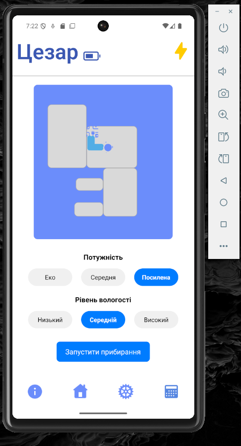
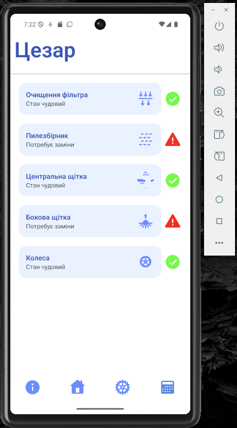
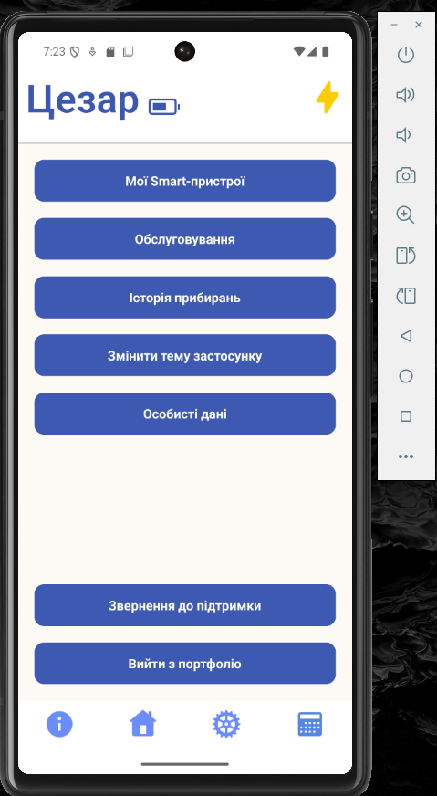
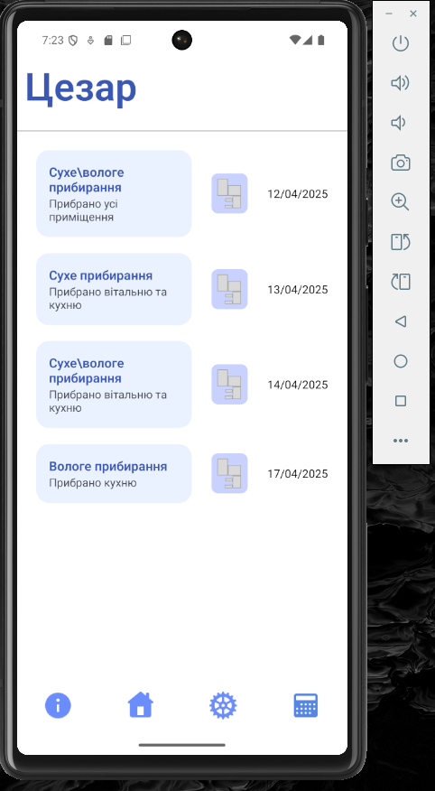
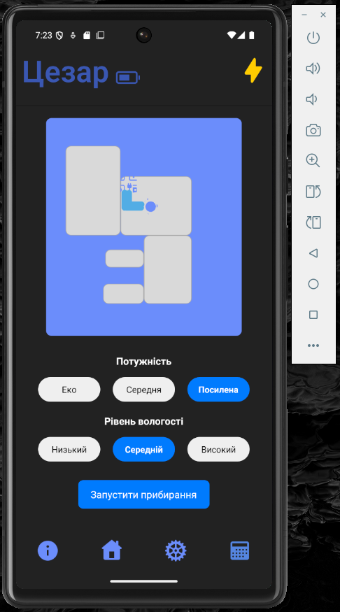
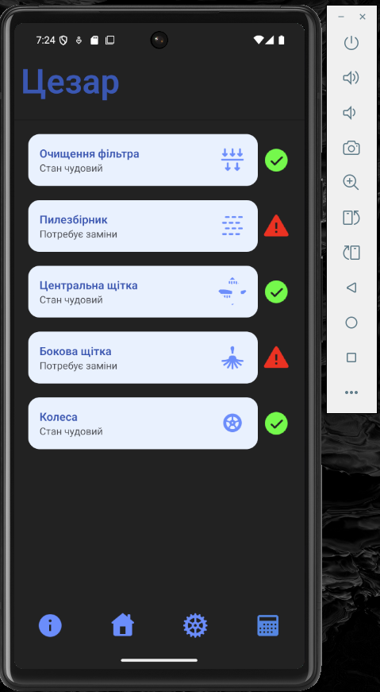
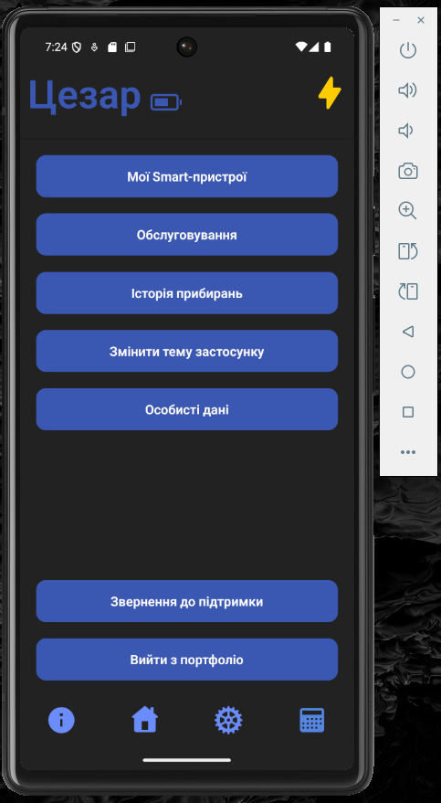

# Оновлено:

## 🌗 Темна тема

**Додано підтримку темної теми.**  
Перемикається вручну через кнопку **"Змінити тему застосунку"** у розділі "Налаштування".

## 🎞 Плавна анімація теми

**Додано анімацію переходу між темами.**  
Завдяки Reanimated перемикання виглядає приємно та плавно.

## 🧹 Вибір режимів прибирання

**На головній сторінці реалізовано вибір потужності та рівня вологості.**  
Параметри:

- Потужність: _Еко / Середня / Посилена_
- Вологість: _Низький / Середній / Високий_

## 🧠 Зберігання стану через Redux

**Усі вибрані значення зберігаються в Redux.**  
Це забезпечує зручне масштабування та передачу даних в інші частини застосунку.

## 🧭 Навігація з налаштувань

**Кнопки в "Налаштуваннях" тепер перенаправляють на відповідні екрани:**

- **"Обслуговування"** → Service
- **"Історія прибирань"** → CleaningHistory

